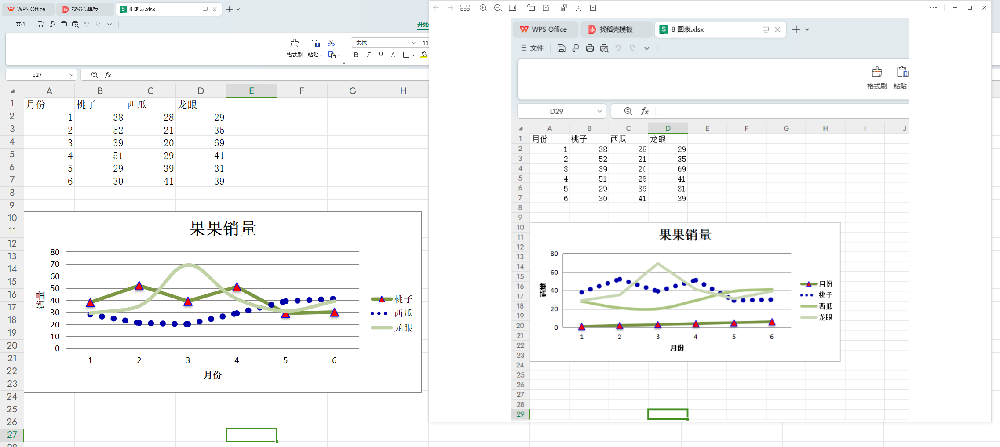

镜像：  
https://pypi.mirrors.ustc.edu.cn/simple    
https://pypi.tuna.tsinghua.edu.cn/simple  

安装 pandas  
pip3 install pandas --trusted-host mirrors.aliyun.com

---
#### pycharm 设置了 aliyun 镜像，但是报错 non-trust

[答案：](https://blog.csdn.net/zhaihao1996/article/details/100919105)  
http://mirrors.aliyun.com/pypi/simple/  
改成  
https://mirrors.aliyun.com/pypi/simple/  

第8课， 为啥列要从2 开始

